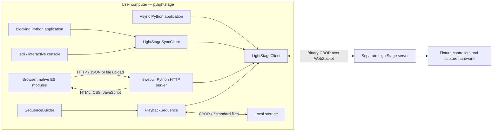
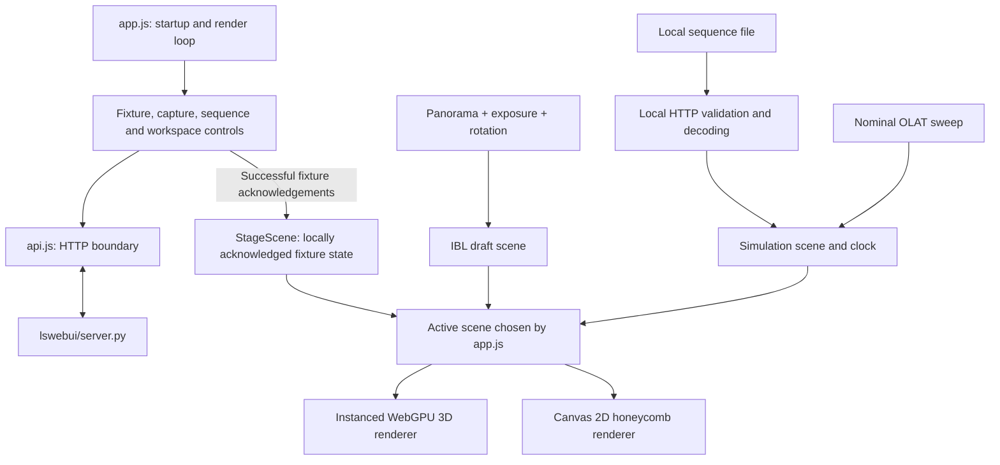
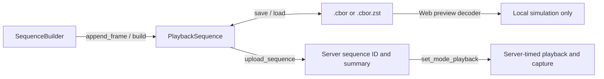
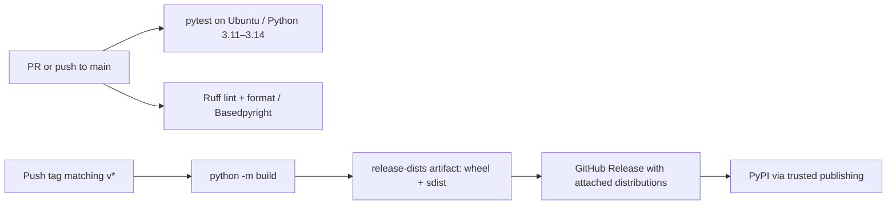

# pylightstage

Python tools for controlling Imperial College London's LightStage through the
[LightStage server WebSocket API][lsserver]. Use the asynchronous or blocking
Python client, the `lscli` terminal interface, or the `lswebui` local browser
interface to control fixtures, trigger captures, and prepare playback sequences.

This repository contains the **client software**. The separate LightStage server
runs beside the hardware and executes commands and capture sequences. You can
build sequences and explore local web previews without a connected stage.

> [!CAUTION]
> ICL's light stage has very bright fixtures that can flash at frequencies up to
> around 30 Hz. Exposure to lights flashing between 3 and 30 Hz **can trigger
> photosensitive epilepsy (PSE) or seizures**. Be careful when running custom
> playback sequences.

This README describes the current source tree. Published releases may contain
fewer features; use the README at the release tag when working with an older
package. In particular, a source checkout can have newer functionality while
still reporting the same package version as a release.

## Contents

- [Install a release](#install-a-release)
- [Install a development build](#install-a-development-build)
- [Connect and run](#connect-and-run)
- [Architecture](#architecture)
- [Modules and technical choices](#modules-and-technical-choices)
- [Python API](#python-api)
- [Terminal interface](#terminal-interface)
- [Web interface](#web-interface)
- [Development and verification](#development-and-verification)
- [Troubleshooting](#troubleshooting)

## Install a release

### 1. Check prerequisites

You need **Python 3.11 or newer** and pip. Git is needed only for Git-based source
installs. The current test workflow covers Python 3.11–3.14 on Ubuntu; it does not
establish equivalent test coverage on Windows or macOS.

```bash
python --version
python -m pip --version
```

If your system uses `python3`, substitute it for `python` when creating the
virtual environment. On Windows, `py -3.11` (or a newer installed version) can be
used instead. The web UI uses a browser; no Node.js, npm, or frontend build step
is required.

### 2. Create an isolated environment

Run this in a directory where you want to keep the installation:

```bash
python -m venv .venv
```

Activate it using the command for your shell:

| Shell | Command |
| --- | --- |
| Linux/macOS, bash or zsh | `source .venv/bin/activate` |
| Windows PowerShell | `.venv\Scripts\Activate.ps1` |
| Windows Command Prompt | `.venv\Scripts\activate.bat` |

Then upgrade pip in that environment:

```bash
python -m pip install --upgrade pip
```

Use an activated environment for all subsequent installation and run commands.
If activation is unavailable, invoke `.venv/bin/python` on Linux/macOS or
`.venv\Scripts\python.exe` on Windows directly.

### 3. Choose a release source

**From PyPI:** install the latest published release:

```bash
python -m pip install --upgrade pylightstage
```

To reproduce a particular release, pin its version. For example, `0.2.0` is a
[published release on PyPI][pypi]:

```bash
python -m pip install "pylightstage==0.2.0"
```

**From a downloaded release asset:** open [GitHub Releases][releases], select a
release, and download its `.whl` file from **Assets**. Install the exact downloaded
filename; this example assumes it is in the current directory:

```bash
python -m pip install ./pylightstage-0.2.0-py3-none-any.whl
```

A package source distribution can be installed the same way:

```bash
python -m pip install ./pylightstage-0.2.0.tar.gz
```

Replace these example filenames with the asset you downloaded. A wheel is already
built; installing a source distribution builds a wheel locally. Either path may
still download dependencies. GitHub's automatically generated **Source code**
archives are repository snapshots, distinct from the packaged `.tar.gz` asset;
extract a snapshot and run `python -m pip install .` inside it.

### 4. Verify the installation

```bash
python -m pip check
python -c "from importlib.metadata import version; import pylightstage; print(version('pylightstage')); print(pylightstage.__file__)"
python -m pylightstage.lscli --help
```

For a version that includes the web UI, also run:

```bash
python -m pylightstage.lswebui --help
```

These checks do not connect to hardware. If a release lacks a feature described
here, follow the development installation below.

## Install a development build

There is currently **no nightly or per-commit wheel publication workflow** in
this repository. To use unreleased work, install from `main`, check out a specific
commit, or build a wheel locally. Development installs can change behavior between
commits; record the commit when reproducing an experiment.

### Option A: editable checkout for development

1. Download the source:

   ```bash
   git clone https://github.com/lightstageurop/pylightstage.git
   cd pylightstage
   git switch main
   ```

2. Create and activate an environment inside the checkout using the shell command
   in [the environment instructions](#2-create-an-isolated-environment):

   ```bash
   python -m venv .venv
   ```

3. Install the checkout and development tools:

   ```bash
   python -m pip install --upgrade pip
   python -m pip install -e .
   python -m pip install --group dev
   ```

   Editable installation makes Python source changes available without
   reinstalling. Browser assets are served from the installed package; reload the
   page after editing them. Reinstall after changing dependencies, entry points,
   or packaging configuration. The `dev` dependencies are a
   [pip dependency group](https://pip.pypa.io/en/stable/user_guide/#dependency-groups)
   in `pyproject.toml`, not a current `[dev]` package extra.

4. Verify the checkout and run the default tests:

   ```bash
   git rev-parse HEAD
   python -m pip check
   python -m pylightstage.lscli --help
   python -m pylightstage.lswebui --help
   python -m pytest
   ```

   Default tests exclude hardware integration tests. Browser regressions run when
   Firefox is installed and otherwise skip.

5. To update an unmodified `main` checkout later:

   ```bash
   git pull --ff-only
   python -m pip install -e .
   python -m pip install --group dev
   ```

   Commit or otherwise preserve local work before updating. To reproduce a
   particular revision instead, use `git checkout --detach COMMIT_SHA`, replacing
   `COMMIT_SHA` with the desired full commit hash, then repeat installation.

If you already use `uv`, `uv sync --group dev` installs the project and development
tools in its managed environment. Run commands as `uv run pytest`,
`uv run lscli --help`, or `uv run lswebui`.

### Option B: install development source without an editable checkout

With Git installed and a virtual environment activated:

```bash
python -m pip install --upgrade "pylightstage @ git+https://github.com/lightstageurop/pylightstage.git@main"
```

For a reproducible install, replace `main` with a full commit hash. This installs a
built copy of that revision; subsequent repository changes do not update it.
Use a fresh environment when switching between release and development builds so
an unchanged version number does not obscure which code is installed.

Without Git, use **Code → Download ZIP** on the [repository][repository], extract
the archive, open a terminal in the extracted directory containing
`pyproject.toml`, and run:

```bash
python -m pip install .
```

### Option C: build downloadable distributions yourself

From a source checkout with its environment activated:

```bash
python -m pip install build
python -m build
```

This creates a wheel (`dist/pylightstage-<version>-py3-none-any.whl`) and source
archive (`dist/pylightstage-<version>.tar.gz`). Copy the wheel to the target machine,
create and activate a fresh environment there, and install its exact path:

```bash
python -m pip install /path/to/pylightstage-0.2.0-py3-none-any.whl
python -m pip check
python -m pylightstage.lswebui --help
```

The example version comes from this checkout's `pyproject.toml`; use your actual
output filename. Builds use that declared version, not an automatically generated
commit version. Keep the commit hash alongside a development artifact. Installing
a wheel still needs access to its dependencies unless they are already available.

## Connect and run

Installation does not start the hardware server. Obtain the WebSocket endpoint
for your stage and ensure your computer can reach it. The source default is
`ws://172.30.40.238:8080/ws`, the configured college-LAN address of `lightstagepi`.
The previously documented dedicated controller-network address is
`ws://10.37.211.100:8080/ws`. Network assignments can change; confirm the endpoint
for your installation and see the [hardware/networking wiki][wiki].

First inspect the server without changing fixtures:

```bash
lscli --uri ws://172.30.40.238:8080/ws get-config
lscli --uri ws://172.30.40.238:8080/ws get-mode
```

Then choose an interface:

```bash
# Guided terminal interface; keep --uri before the subcommand.
lscli --uri ws://172.30.40.238:8080/ws interactive

# Local browser interface, with the hardware endpoint configured explicitly.
lswebui --uri ws://172.30.40.238:8080/ws
```

The web UI opens `http://127.0.0.1:8000/` by default. Stop it with Ctrl-C.
It can also start while the stage is disconnected for local previews.

## Architecture

### System boundaries



All hardware paths share `LightStageClient`. The CLI uses its synchronous wrapper;
the web backend runs asynchronous client operations for HTTP requests. The browser
does not open the hardware WebSocket directly. Playback timing and hardware
capture belong to the separate server, rather than the browser rendering loop.

### Requests, responses, and events

```mermaid
sequenceDiagram
    participant Caller as Python / CLI / web backend
    participant Client as LightStageClient
    participant Server as LightStage server
    participant Receiver as Client receiver task
    Caller->>Client: Call a client method
    Client->>Client: Validate input; allocate request ID and Future
    Client->>Server: Binary CBOR {id, command}
    Server-->>Receiver: Response {id, response}
    Receiver->>Client: Resolve matching pending Future
    Client-->>Caller: Result, or raised error
    Server-->>Receiver: Event notification
    Receiver-->>Caller: Registered event callback
```

One receiver task demultiplexes responses by request ID and dispatches unsolicited
events. Connection setup and ordinary request waits default to five seconds;
sequence uploads allow 60 seconds by default. Disconnects fail pending requests,
and server error responses become Python exceptions. Applications own connection
lifetimes through context managers or explicit `connect()`/`close()` calls.

Individual fixture operations can be buffered with `go=False`; `go()` merges the
queued per-fixture RGB/white updates into a `SetFixtures` request. A lock serializes
flushes, while updates queued during an outstanding request remain for the next
flush. Failed batches are retained, with newer channel values taking precedence.
A retained batch is not automatically resent, and a failed command does not imply
that the server applied nothing.

### Browser state and rendering



The renderers consume the same scene representation, so switching views preserves
selection and displayed fixture state. IBL drafts and simulations use separate
preview scenes. Applying an IBL draft is an explicit hardware action; simulation
never sends hardware commands. Sequence preview decoding uses the local HTTP
server even when the hardware server is unavailable.

The fixture view represents **locally acknowledged commands, not live hardware
readback**. Mode is polled every three seconds while reachable. Changes made by
another client need not appear as fixture colors, and capture progress is not
tracked. A multi-target operation may partially execute before reporting failure;
the UI does not automatically retry hardware commands.

## Modules and technical choices

### Repository map

```text
pylightstage/
├── pyproject.toml              # Metadata, dependencies, entry points, tool settings
├── src/pylightstage/
│   ├── __init__.py             # Public API exports
│   ├── client.py               # Async transport/API and blocking adapter
│   ├── models.py               # Modes, capture config, frame/sequence dataclasses
│   ├── sequences.py            # Mutable SequenceBuilder and frame snapshots
│   ├── utils.py                # Index/intensity validation and polarization mapping
│   ├── lscli/
│   │   ├── __init__.py         # Argument parser, command dispatch, main()
│   │   ├── __main__.py         # python -m pylightstage.lscli
│   │   └── interactive.py      # Persistent, reconnectable terminal menus
│   └── lswebui/
│       ├── __init__.py         # Launch options, browser opening, public server API
│       ├── __main__.py         # python -m pylightstage.lswebui
│       ├── server.py           # Static assets, HTTP routes, client operations
│       ├── sequence_files.py   # JSON/CBOR validation and bounded decompression
│       ├── validation.py       # Shared web capture-rate validation
│       └── static/
│           ├── index.html, styles.css
│           ├── app.js, api.js  # Application orchestration and HTTP requests
│           ├── scene.js        # Renderer-independent state and fixture geometry
│           ├── fixture-controls.js, capture.js, sequences.js, workspace.js
│           ├── ibl.js, environment-map.js  # Panorama import and sampling
│           ├── simulation.js   # Local OLAT/playback preview and playback clock
│           ├── camera.js, math.js, dom.js  # Picking, camera and shared utilities
│           └── renderers/
│               ├── webgpu.js   # Instanced 3D rendering and GPU shaders
│               ├── canvas2d.js # Selectable 2D grid fallback
│               └── labels.js   # Stage labels
├── examples/                  # Async, sync, events and playback examples
├── tests/                     # Unit, HTTP, browser and hardware integration tests
└── .github/workflows/         # Lint, test and tag-triggered release pipelines
```

### Why these components fit together

| Choice | Purpose and implications |
| --- | --- |
| `asyncio` + `websockets` | Allows command replies and server events to share a connection without blocking an async application. |
| Blocking adapter over the async client | `LightStageSyncClient` runs an event loop in a background thread and waits for submitted coroutines; the protocol implementation stays shared. |
| CBOR via `cbor2` | Matches the server's binary WebSocket protocol and provides the sequence file representation. Browser HTTP payloads use JSON instead. |
| Zstandard via `zstandard` | Compresses sequence files ending in `.zst`; sequence upload sends the decoded model over CBOR, not the compressed file bytes. |
| Dataclasses and `StageMode` | Give capture configuration, frames, sequence metadata and modes explicit Python representations. |
| Mutable builder, frame snapshots | Makes sequences convenient to construct while copying each appended frame so later edits do not overwrite earlier frames. |
| Shared validation and conversion | Keeps fixture indices, color selectors, polarization mapping and intensity scaling consistent across the Python client and sequence builder. |
| Standard-library `ThreadingHTTPServer` | Serves the UI and dispatches local requests without adding a Python web framework. Hardware operations open a client connection per HTTP operation; there is no persistent browser-to-stage session. |
| Native JavaScript ES modules | Keeps control, state, sampling and rendering modules separate without a frontend package manager or bundler. |
| WebGPU with Canvas 2D fallback | Provides an instanced 3D view where supported and a usable grid where WebGPU is unavailable. |
| Setuptools with a `src/` layout | Packages the Python modules and static browser assets together; one install provides both console entry points. |

Runtime dependencies are just `websockets`, `cbor2`, and `zstandard`.
Development dependencies add pytest, pytest-asyncio, coverage, Ruff, and
Basedpyright. See [pyproject.toml](pyproject.toml) for the authoritative lists.

### Hardware and data model

| Concept | Representation |
| --- | --- |
| Logical fixture | `(arc, light)`, with 12 arcs (`0`–`11`) and 14 lights per arc (`0`–`13`): 168 positions. |
| RGB intensity | Three numbers `(red, green, blue)` in the public `0`–`255` range. |
| White intensity | Three numbers `(warm, neutral, cool)` in the same range. |
| Color selector | `rgb`, `w`, or `rgbw`; `rgbw` applies the supplied triplet to both groups. |
| Wire/frame channel values | Integer triplets in `0`–`65535`, scaled from public intensities. |
| Polarization selector | `up`, `cp`, or `pp`; physical RGB/white channel selection depends on arc/light position. |
| `StageFrame` | White and RGB grids indexed `[arc][light]`, containing 16-bit triplets. |
| `PlaybackSequence` | Name, `capture_hz`, and ordered frames; duration is frame count divided by capture rate. |
| `SequenceSummary` | Server ID, name, rate, frame count and duration; fetching a summary does not download its frames. |

The public `0`–`255` range and `turn_on_*`/`turn_off_*` aliases retain familiar
behavior from the older `lightstage.py` API. The server protocol uses 16-bit values.
Manually constructed frame data must therefore already use the 16-bit range;
`SequenceBuilder` performs conversion for you.

## Python API

### Asynchronous and blocking clients

This first example only reads server state:

```python
import asyncio
from pylightstage import LightStageClient

URI = "ws://172.30.40.238:8080/ws"

async def main():
    async with LightStageClient(uri=URI) as client:
        print(await client.get_config())
        print(await client.get_mode())

if __name__ == "__main__":
    asyncio.run(main())
```

For scripts without an event loop, use the same methods without `await`:

```python
from pylightstage import LightStageSyncClient

with LightStageSyncClient(uri="ws://172.30.40.238:8080/ws") as client:
    print(client.get_config())
    print(client.get_mode())
```

To control fixtures, use `set_light`, `set_arc`, `set_horizontal_arc`,
`set_lightstage`, or `set_pol_light`, and their corresponding `clear_*` methods.
For example, inside an async client context, this queues two dim red fixtures and
sends them together:

```python
await client.set_mode_manual()
await client.set_light(arc=0, light=0, color="rgb", intensity=(16, 0, 0), go=False)
await client.set_light(arc=0, light=1, color="rgb", intensity=(16, 0, 0), go=False)
await client.go()
```

These commands change real hardware. Closing a client closes its connection; it
does not automatically clear lights or restore the previous mode.

### Modes and events

Use `set_mode_manual()`, `set_mode_demo()`, `set_mode_olat(capture_hz)`, or
`set_mode_playback(sequence_id)`. `trigger()` requests a camera capture in Manual
mode. `set_mode()` also accepts `StageMode` and `CaptureConfig` for explicit mode
configuration.

Register synchronous or asynchronous callbacks with `client.on_event`, and use
`wait_for_event()` or `wait_until_disconnected()` when an application needs to
wait. Async-client synchronous callbacks run in the receiver's event loop and
should not block it. The blocking adapter runs synchronous event callbacks in a
worker thread. See [the event example](examples/10_events.py).

### Build and save a sequence locally

This example requires no server and does not change the hardware:

```python
from pylightstage import PlaybackSequence, SequenceBuilder

builder = SequenceBuilder(name="Dim red frame", capture_hz=1.0)
builder.set_light(arc=0, light=0, color="rgb", intensity=(16, 0, 0))
builder.append_frame()
builder.clear_light(arc=0, light=0)
builder.append_frame()

sequence = builder.build()
sequence.save("red-frame.cbor.zst")
loaded = PlaybackSequence.load("red-frame.cbor.zst")
print(loaded.to_summary())
```

By default, builder state carries into the next frame. Set `auto_clear=True` to
reset it after every `append_frame()`. Saving to `.cbor` writes plain CBOR; saving
to `.cbor.zst` compresses it. `PlaybackSequence.load()` and CLI uploads read those
formats; the web importer additionally accepts JSON.



To run it on hardware, upload the model with `await client.upload_sequence(loaded)`
and pass the returned summary's `id` to `await client.set_mode_playback(id)`.
Use `list_sequences()`, `get_sequence(id)`, and `delete_sequence(id)` to manage
server sequences. See [the runnable examples](examples/README.md) for complete
async, blocking, event, and playback workflows.

## Terminal interface

`lscli` with no subcommand, or `lscli interactive`, opens the guided console and
keeps a connection for the session. Enter `b` to go back/cancel and `q` at the main
menu to exit. Other invocations connect, perform their operation, and disconnect;
a single operation may involve several server requests.

```bash
lscli --help
python -m pylightstage.lscli --help
lscli --uri ws://172.30.40.238:8080/ws interactive
```

Place the global `--uri` option before the command. The following examples control
hardware; replace the endpoint with your stage's address:

```bash
lscli --uri ws://172.30.40.238:8080/ws set-mode manual
lscli --uri ws://172.30.40.238:8080/ws set-light --arc 0 --light 4 --color rgb --intensity 16 0 0
lscli --uri ws://172.30.40.238:8080/ws clear-light --arc 0 --light 4
lscli --uri ws://172.30.40.238:8080/ws upload-sequence red-frame.cbor.zst
lscli --uri ws://172.30.40.238:8080/ws list-sequences
```

| Commands | Purpose / required options |
| --- | --- |
| `get-config`, `get-mode` | Print server data as JSON. |
| `interactive` (`i`) | Guided, reconnectable terminal control. |
| `set-mode demo\|manual\|olat\|playback` | OLAT requires `--capture-hz`; Playback requires `--sequence-id`. |
| `trigger` | Request a camera capture in Manual mode. |
| `set-light`, `clear-light` | One fixture: `--arc` and `--light`. |
| `set-arc`, `clear-arc` | One vertical arc: `--arc`. |
| `set-horizontal-arc`, `clear-horizontal-arc` | The same `--light` index across every arc. |
| `set-lightstage`, `clear-lightstage` | All fixtures. |
| `set-polarized-light`, `clear-polarized-light` | `--arc`, `--light`, and optional `--polarization up\|cp\|pp`. |
| `upload-sequence PATH` | Upload a local `.cbor` or `.cbor.zst` file. |
| `list-sequences` | List server sequence summaries. |
| `get-sequence ID`, `delete-sequence ID` | Inspect metadata or delete a server sequence. |

Set commands default to `--color rgbw --intensity 255 255 255`; specify lower
intensities when needed. Clear commands default to `--color rgbw`. Polarized
commands choose channels through the physical polarization mapping. Use
`lscli COMMAND --help` for exact options. Invalid input, file failures, connection
failures and server errors produce a nonzero exit status; commands with no result
are silent on success.

## Web interface

### Launch and configure

```bash
lswebui
python -m pylightstage.lswebui --help
lswebui --bind 127.0.0.1 --port 8081 --uri ws://172.30.40.238:8080/ws
lswebui --port 0 --no-browser
```

The defaults are `127.0.0.1:8000` with automatic browser opening. Port `0` selects an
available port and prints its URL. Add `--log-requests` for HTTP request logs.
Binding to `0.0.0.0` exposes the local control server to other hosts; use this only
on a trusted network. WebGPU requires a browser secure context: loopback HTTP is
suitable, while remote access should use an HTTPS reverse proxy.

### Workspaces

| Feature | Workflow and hardware effect |
| --- | --- |
| Fixture control | Select individual fixtures, vertical arcs or horizontal arcs in 3D or the 2D grid. Shift-click adds targets; Ctrl-click toggles them. Apply RGB/W or UP/CP/PP controls explicitly. Selection and intensity editing alone send no commands. |
| Playback library | Open **Sequences**, import `.cbor`, `.cbor.zst`, or `.json`, inspect metadata, and play/delete uploaded sequences. **Return to manual** switches out of playback. Imports are limited to 64 MiB, including expanded data. |
| Capture / OLAT | Enter a positive capture rate and choose **Start OLAT** to request one-light-at-a-time capture. **Return to manual** changes back. Status confirms requests, not capture progress or completion. Manual camera triggering is also available. |
| Local simulation | Choose **Simulate OLAT** or a local playback file. Pause/resume, restart, scrub or stop the preview without hardware commands, including while disconnected. |
| Image-based lighting (IBL) | Import a 2:1 equirectangular PNG, JPEG or WebP up to 16 MiB, adjust exposure in EV and horizontal rotation, then explicitly choose **Switch to manual and apply**. This sends RGB intensities and clears white emitters in one fixture batch after switching mode. |

Simulation uses playback files' capture rates and 16-bit channel values; omitted
channels retain their preceding values. OLAT simulation is a nominal sweep in
arc/light order with selectable RGB or white emitters. Previews run once and hold
the final frame. Stopping or changing workspace restores the acknowledged fixture
view. Browser refresh rate limits visible frames; simulation is not synchronized
capture telemetry.

IBL sampling averages sRGB pixels in linear light with solid-angle weighting over
the stage's angular cells. The panorama center faces arc 0; positive 90° rotation
moves it to arc 3. Sampling uses nominal visualizer geometry without photometric
calibration. The preview shows fixture output, not a rendered subject. HDR/EXR
input is not supported. Leaving IBL restores the acknowledged fixture view.

### HTTP boundary and embedding

| Route | Role |
| --- | --- |
| `GET /api/health` | Local HTTP readiness; not proof of hardware connectivity. |
| `GET /api/config` | Browser bootstrap configuration. |
| `GET /api/inspect?action=...` | Server config, mode or sequence-list inspection. |
| `POST /api/fixture` | Validated fixture control. |
| `POST /api/mode`, `POST /api/capture` | Manual/OLAT requests and camera triggering. |
| `POST /api/sequences` | Play/delete a stored sequence or return to Manual. |
| `POST /api/sequences/import` | Decode, validate and upload a sequence file. |
| `POST /api/sequences/preview` | Decode and validate a local sequence for simulation. |
| `POST /api/ibl` | Apply a complete RGB environment pattern. |

These are the local UI's routes; the hardware server has its own WebSocket API.
The backend validates file structure and bounds Zstandard expansion before
constructing playback models. Static files are loaded through Python package
resources, so the interface also works from a wheel installation.

Applications can embed the local server:

```python
from pylightstage.lswebui import ServerConfig, create_server

config = ServerConfig(port=0, lightstage_uri="ws://127.0.0.1:8080/ws")
with create_server(config) as server:
    host, port = server.server_address[:2]
    print(f"Serving on {host}:{port}")
    server.serve_forever()
```

## Development and verification

After installing the development dependency group, run:

```bash
python -m pytest
python -m ruff check .
python -m ruff format --check .
python -m basedpyright
```

The test suite covers transport/connection behavior, the async and blocking APIs,
events, sequence construction, validation, CLI dispatch, HTTP handling, and
browser interactions. Browser tests use actual ES modules and DOM events through
a temporary HTTP server and headless Firefox; install Firefox to include them.
They do not require stage hardware.

Hardware integration tests are explicitly opt-in and **change fixture states and
modes**. They currently use `REAL_SERVER_URI` in
[tests/test_integration.py](tests/test_integration.py); adjust that constant for
another installation. They skip if the endpoint is unreachable.

```bash
python -m pytest -m integration  # Hardware tests only
python -m pytest -m ""           # All tests, including hardware
```

### CI and release flow



[Tests](.github/workflows/test.yml) and [linting](.github/workflows/lint.yml) run on
pull requests and pushes to `main`. The separate
[release workflow](.github/workflows/release.yml) builds on Python 3.11 when a
`v*` tag is pushed, attaches distributions to a GitHub Release, then publishes them
to PyPI. It does not itself run the lint/test jobs or derive the package version
from the tag; maintainers must keep the version in `pyproject.toml` aligned with
the intended release and verify the commit before tagging.

See [CONTRIBUTING.md](CONTRIBUTING.md) for contribution guidance and
[examples/](examples/) for runnable scripts.

## Troubleshooting

| Symptom | Check or fix |
| --- | --- |
| `lscli` or `lswebui` is not found | Activate the environment used for installation, or use `python -m pylightstage.lscli` / `python -m pylightstage.lswebui`. |
| `No module named pylightstage.lswebui` | Check the installed path/version; your release may predate the UI. Install the current source in a fresh environment. |
| pip does not recognize `--group` | Upgrade pip inside the environment and run the command from the checkout containing `pyproject.toml`. |
| Changes do not appear after installation | Check `pylightstage.__file__`, confirm the checkout is installed with `-e .`, and reload the browser for static asset changes. |
| Connection refused or timeout | Check the explicit WebSocket URI, `/ws` path, network/VPN access and running hardware server. The local HTTP port and remote WebSocket port are separate settings. |
| Local web server cannot bind its port | Use `lswebui --port 0` or another free port. |
| WebGPU is unavailable | Use the Canvas 2D grid; check browser/GPU support and the secure-context requirement for 3D. |
| Fixture display differs from the stage | The UI keeps locally acknowledged state; it does not read back all fixture values or track other clients' changes. |
| Sequence import is rejected | Check extension, dimensions, finite positive capture rate, 16-bit channel values, and the 64 MiB upload/expanded-size limit. |
| Browser tests are skipped | Install Firefox and ensure `firefox` is on `PATH`. |

## License

Distributed under the [MIT License](LICENSE).

[repository]: https://github.com/lightstageurop/pylightstage
[releases]: https://github.com/lightstageurop/pylightstage/releases
[pypi]: https://pypi.org/project/pylightstage/
[lsserver]: https://github.com/lightstageurop/lightstage-server-rs/tree/master/lsserver
[wiki]: https://github.com/lightstageurop/lightstage-server-rs/wiki
