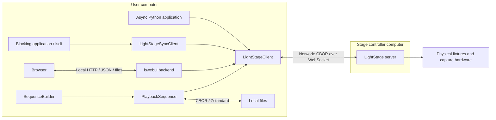
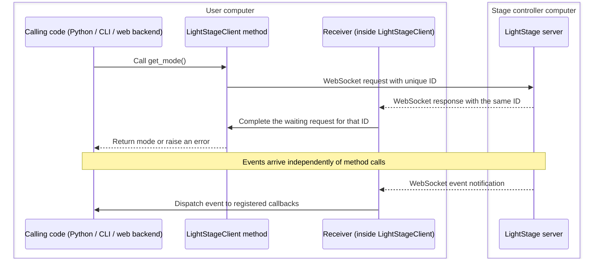

# pylightstage

Python clients, a terminal interface (`lscli`), and a local browser interface
(`lswebui`) for Imperial College London's [LightStage server][lsserver]. Control
fixtures, trigger captures, and build playback sequences. Local sequence building
and web previews work without hardware.

> [!CAUTION]
> LightStage fixtures can flash at up to around 30 Hz. Flashing lights between
> 3 and 30 Hz can trigger photosensitive epilepsy or seizures. Use care with
> custom playback sequences.

This README covers the source checkout; older releases may have fewer features.

Start with [installation](#installation) and [connection](#connect-and-run), then
use the [web interface](#web-interface), [terminal interface](#terminal-interface),
or [Python API](#python-api). [Developer reference](#developer-reference) is at the end.

## Installation

Requires Python 3.11+ and pip. The web UI needs a browser, with no frontend build.

```bash
python -m venv .venv
source .venv/bin/activate
python -m pip install --upgrade pip
python -m pip install pylightstage
```

On Windows, activate with `.venv\Scripts\Activate.ps1` (PowerShell) or
`.venv\Scripts\activate.bat` (Command Prompt). Use `python3` or `py` if needed.

You can also install a wheel or source distribution from [GitHub Releases][releases]:

```bash
python -m pip install /path/to/pylightstage-<version>-py3-none-any.whl
```

Check the installation without connecting to hardware:

```bash
python -m pip check
python -m pylightstage.lscli --help
python -m pylightstage.lswebui --help
```

For unreleased features, see the source installation instructions under
[Developer reference](#developer-reference).

## Connect and run

The hardware server runs separately. Confirm your stage's WebSocket endpoint and
network access; the default is `ws://172.30.40.238:8080/ws`. See the
[hardware/networking wiki][wiki].

```bash
# Read server state.
lscli --uri ws://172.30.40.238:8080/ws get-config
lscli --uri ws://172.30.40.238:8080/ws get-mode

# Start a terminal or browser interface.
lscli --uri ws://172.30.40.238:8080/ws interactive
lswebui --uri ws://172.30.40.238:8080/ws
```

The web UI opens at `http://127.0.0.1:8000/`. Stop it with Ctrl-C.

## Web interface

```bash
lswebui
lswebui --bind 127.0.0.1 --port 8081 --uri ws://172.30.40.238:8080/ws
lswebui --port 0 --no-browser
```

Defaults: `127.0.0.1:8000`, automatic browser opening. Port `0` chooses a free port;
`--log-requests` enables HTTP logs. Bind to `0.0.0.0` only on a trusted network.
WebGPU needs a secure context: loopback HTTP works; remote access needs HTTPS.

| Workspace | Workflow |
| --- | --- |
| Fixtures | Select fixtures or arcs in 3D or 2D. Shift-click adds targets; Ctrl-click toggles. Apply RGB/W or polarization controls explicitly. |
| Sequences | Import `.cbor`, `.cbor.zst`, or `.json`; inspect, play or delete sequences. Imports and expanded data are limited to 64 MiB. |
| Capture / OLAT | Set a positive rate and start OLAT, trigger Manual capture, or return to Manual. Status confirms requests, not capture completion. |
| Simulation | Preview OLAT or local playback with pause, scrub and restart, including while disconnected. No hardware commands. |
| IBL | Import a 2:1 PNG, JPEG or WebP panorama up to 16 MiB; adjust exposure and rotation. **Switch to manual and apply** sends RGB and clears white emitters. |

Fixture colors reflect this UI's acknowledged commands, not live hardware
readback. Other clients' changes may not appear. Hardware commands can partially
execute on failure and are not retried automatically.

Simulations run once and hold the final frame; omitted channels retain previous
values. Stopping or changing workspace restores the acknowledged fixture view.
Visible playback is limited by browser refresh rate.

IBL averages sRGB pixels in linear light with solid-angle weighting. The panorama
center faces arc 0; +90° rotation moves it to arc 3. It uses nominal geometry without
photometric calibration and previews fixture output. HDR/EXR is unsupported.

## Terminal interface

`lscli` or `lscli interactive` opens a persistent console. Enter `b` to go back or
cancel, and `q` at the main menu to exit. Other commands connect and disconnect
for each operation. Place `--uri` before the subcommand.

```bash
lscli --help
lscli --uri ws://172.30.40.238:8080/ws set-mode manual
lscli --uri ws://172.30.40.238:8080/ws set-light --arc 0 --light 4 --color rgb --intensity 16 0 0
lscli --uri ws://172.30.40.238:8080/ws clear-light --arc 0 --light 4
lscli --uri ws://172.30.40.238:8080/ws upload-sequence red-frame.cbor.zst
```

| Commands | Options / purpose |
| --- | --- |
| `get-config`, `get-mode` | Print server data as JSON. |
| `set-mode demo\|manual\|olat\|playback` | OLAT needs `--capture-hz`; playback needs `--sequence-id`. |
| `trigger` | Camera capture in Manual mode. |
| `set-light`, `clear-light` | `--arc`, `--light`. |
| `set-arc`, `clear-arc` | `--arc`. |
| `set-horizontal-arc`, `clear-horizontal-arc` | `--light` across all arcs. |
| `set-lightstage`, `clear-lightstage` | All fixtures. |
| `set-polarized-light`, `clear-polarized-light` | `--arc`, `--light`, optional `--polarization up\|cp\|pp`. |
| `upload-sequence PATH` | Upload `.cbor` or `.cbor.zst`. |
| `list-sequences` | List summaries. |
| `get-sequence ID`, `delete-sequence ID` | Inspect metadata or delete. |

Set commands default to `--color rgbw --intensity 255 255 255`; clear commands use
`--color rgbw`. Use `lscli COMMAND --help` for options. Errors return a nonzero
exit status.

## Python API

### Clients

```python
import asyncio
from pylightstage import LightStageClient

async def main():
    async with LightStageClient(uri="ws://172.30.40.238:8080/ws") as client:
        print(await client.get_config())
        print(await client.get_mode())

if __name__ == "__main__":
    asyncio.run(main())
```

The blocking client exposes the same methods without `await`:

```python
from pylightstage import LightStageSyncClient

with LightStageSyncClient(uri="ws://172.30.40.238:8080/ws") as client:
    print(client.get_config())
    print(client.get_mode())
```

Control fixtures with `set_light`, `set_arc`, `set_horizontal_arc`, `set_lightstage`,
`set_pol_light`, and corresponding `clear_*` methods. Inside an async client context:

```python
await client.set_mode_manual()
await client.set_light(arc=0, light=0, color="rgb", intensity=(16, 0, 0), go=False)
await client.set_light(arc=0, light=1, color="rgb", intensity=(16, 0, 0), go=False)
await client.go()
```

These commands change hardware. Closing the connection does not clear fixtures or
restore the previous mode.

### Modes and events

Use `set_mode_manual()`, `set_mode_demo()`, `set_mode_olat(capture_hz)`, or
`set_mode_playback(sequence_id)`. `trigger()` requests a camera capture in Manual
mode. `set_mode()` accepts `StageMode` and `CaptureConfig`.

Register callbacks with `on_event`; wait with `wait_for_event()` or
`wait_until_disconnected()`. Synchronous callbacks must not block the async
receiver loop; the blocking adapter runs them in a worker thread.
See [the event example](examples/10_events.py).

### Sequences

Build and save sequences without a server:

```python
from pylightstage import PlaybackSequence, SequenceBuilder

builder = SequenceBuilder(name="Dim red frame", capture_hz=1.0)
builder.set_light(arc=0, light=0, color="rgb", intensity=(16, 0, 0))
builder.append_frame()
builder.clear_light(arc=0, light=0)
builder.append_frame()

sequence = builder.build()
sequence.save("red-frame.cbor.zst")
loaded = PlaybackSequence.load("red-frame.cbor.zst")
```

Builder state carries between frames unless `auto_clear=True`. Files use `.cbor`
or compressed `.cbor.zst`; the web importer also accepts JSON.

Upload with `await client.upload_sequence(loaded)`, then pass the returned summary's
`id` to `await client.set_mode_playback(id)`. Manage stored sequences with
`list_sequences()`, `get_sequence(id)`, and `delete_sequence(id)`.
See [examples/README.md](examples/README.md) for complete workflows.

## Troubleshooting

| Problem | Fix |
| --- | --- |
| Command not found | Activate your environment or use `python -m pylightstage.lscli` / `python -m pylightstage.lswebui`. |
| Missing web UI | Install current source; older releases may lack it. |
| Connection fails | Check the WebSocket URI, `/ws`, network/VPN and hardware server. |
| HTTP port in use | Use `lswebui --port 0`. |
| WebGPU unavailable | Use the 2D grid; check browser/GPU support and secure context. |
| Display differs from hardware | Fixture colors track this UI's acknowledged commands only. |
| Import rejected | Check format, dimensions, positive finite rate, 16-bit values and size limits. |

## License

[MIT](LICENSE).

## Developer reference

<details>
<summary>Architecture, request handling, and browser state</summary>

## Architecture


```mermaid
flowchart LR
    subgraph Computer["User computer"]
        Async["Async Python application"] --> Client["LightStageClient"]
        CLI["Blocking application / lscli"] --> Sync["LightStageSyncClient"]
        Sync --> Client
        Browser["Browser"] <-->|"Local HTTP / JSON / files"| Web["lswebui backend"]
        Web --> Client
        Builder["SequenceBuilder"] --> Sequence["PlaybackSequence"]
        Sequence --> Client
        Sequence <-->|"CBOR / Zstandard"| Disk["Local files"]
    end
    subgraph Controller["Stage controller computer"]
        Server["LightStage server"]
    end
    Client <-->|"Network: CBOR over WebSocket"| Server
    Server --> Hardware["Physical fixtures and capture hardware"]
```

The boxes group software by device. `LightStageClient` runs on the user computer;
the LightStage server runs on the stage controller computer and controls the
hardware. The browser talks to the local `lswebui` backend, which uses the Python
client to reach the server. The server handles playback timing and capture.

### Requests, responses, and events

The participants below are software units, grouped by the computer they run on.
The **receiver** is a background task inside `LightStageClient`, not another
device or server. It continuously reads the same WebSocket used to send requests.


```mermaid
sequenceDiagram
    box User computer
        participant App as Calling code (Python / CLI / web backend)
        participant Client as LightStageClient method
        participant Receiver as Receiver (inside LightStageClient)
    end
    box Stage controller computer
        participant Server as LightStage server
    end
    App->>Client: Call get_mode()
    Client->>Server: WebSocket request with unique ID
    Server-->>Receiver: WebSocket response with the same ID
    Receiver->>Client: Complete the waiting request for that ID
    Client-->>App: Return mode or raise an error
    Note over App,Server: Events arrive independently of method calls
    Server-->>Receiver: WebSocket event notification
    Receiver->>App: Dispatch event to registered callbacks
```

**Requests and responses:** a method such as `await client.get_mode()` assigns a
unique request ID, sends the command, and waits for its result. The receiver uses
the response ID to complete the matching wait. Internally, that wait is an
`asyncio.Future`: a placeholder for the result. IDs keep replies matched correctly
when several requests share a connection.

**Events:** the server can also send notifications that are not replies to a
request. The receiver dispatches these to callbacks registered with `on_event`;
they do not complete a waiting method call.

Connection and request timeouts default to five seconds; uploads allow 60 seconds.
Disconnects fail pending requests, and server errors become Python exceptions.
Use context managers or `connect()` / `close()` to manage connections.

Fixture updates with `go=False` are queued until `go()` sends a merged
`SetFixtures` request. Failed batches are retained for an explicit retry, with
newer values taking precedence. Failure does not guarantee that nothing was applied.

### Browser state

The WebGPU 3D view and Canvas 2D grid share scene state. IBL drafts and simulations
use separate previews; applying IBL explicitly sends hardware commands, while
simulation uses only local file decoding.

Fixture colors reflect locally acknowledged commands, not hardware readback.
Mode is polled every three seconds while reachable. Other clients' fixture changes
and capture progress are not tracked. Commands may partially execute on failure;
the UI does not retry them automatically.

</details>

<details>
<summary>Modules, data model, and HTTP API</summary>

## Modules and data model

| Module | Purpose |
| --- | --- |
| `client.py` | Async WebSocket API and blocking adapter. |
| `models.py` | Modes, capture config, frames and sequences. |
| `sequences.py` | Sequence builder and frame snapshots. |
| `utils.py` | Validation, intensity scaling and polarization mapping. |
| `lscli/` | Command parsing and interactive console. |
| `lswebui/server.py` | Static assets and HTTP routes. |
| `lswebui/sequence_files.py` | File validation and bounded decompression. |
| `lswebui/static/` | Native JavaScript modules, controls, previews and renderers. |
| `examples/`, `tests/` | Runnable examples and automated tests. |

Runtime dependencies are `websockets`, `cbor2`, and `zstandard`. See
[pyproject.toml](pyproject.toml) for dependencies and tool settings.

| Concept | Representation |
| --- | --- |
| Fixture | `(arc, light)`: 12 arcs (`0`–`11`), 14 lights each (`0`–`13`). |
| RGB / white intensity | `(red, green, blue)` / `(warm, neutral, cool)` in `0`–`255`. |
| Color selector | `rgb`, `w`, or `rgbw` (same triplet for both groups). |
| Polarization | `up`, `cp`, or `pp`, mapped to physical channels by position. |
| `StageFrame` | White and RGB grids indexed `[arc][light]`, with 16-bit triplets. |
| `PlaybackSequence` | Name, `capture_hz`, and frames. Duration = frames / rate. |
| `SequenceSummary` | Server ID, name, rate, frame count and duration. |

The client and builder scale public intensities to `0`–`65535`. Manually constructed
frames must already use that range. Sequence summaries do not contain frame data.

### HTTP API and embedding

| Route | Purpose |
| --- | --- |
| `GET /api/health` | Local readiness, not hardware connectivity. |
| `GET /api/config` | Browser configuration. |
| `GET /api/inspect?action=...` | Server config, mode or sequence list. |
| `POST /api/fixture` | Fixture control. |
| `POST /api/mode`, `POST /api/capture` | Mode changes and camera triggering. |
| `POST /api/sequences` | Play/delete or return to Manual. |
| `POST /api/sequences/import` | Validate and upload a file. |
| `POST /api/sequences/preview` | Validate and decode for simulation. |
| `POST /api/ibl` | Apply RGB environment lighting. |

Embed the local server:

```python
from pylightstage.lswebui import ServerConfig, create_server

config = ServerConfig(port=0, lightstage_uri="ws://127.0.0.1:8080/ws")
with create_server(config) as server:
    host, port = server.server_address[:2]
    print(f"Serving on {host}:{port}")
    server.serve_forever()
```

</details>

<details>
<summary>Source installation, development, testing, and releases</summary>

### Development build

For an editable checkout, create and activate a virtual environment, then run:

```bash
git clone https://github.com/lightstageurop/pylightstage.git
cd pylightstage
python -m pip install --upgrade pip
python -m pip install -e .
python -m pip install --group dev
```

Alternatively, use `uv sync --group dev` and run commands with `uv run`.
Editable installs pick up Python changes; reload the browser after asset changes.
Reinstall after changing dependencies or entry points.

To install directly from Git:

```bash
python -m pip install --upgrade "pylightstage @ git+https://github.com/lightstageurop/pylightstage.git@main"
```

Replace `main` with a full commit hash for reproducibility. There are no nightly
wheels; build distributions locally with `python -m pip install build` followed by
`python -m build`. Outputs go to `dist/`. Development builds use the version in
`pyproject.toml`, so record the commit hash as well.

| Problem | Fix |
| --- | --- |
| pip rejects `--group` | Upgrade pip and run from the checkout. |
| Edits do not appear | Check `pylightstage.__file__`, install with `-e .`, and reload the browser. |

## Development and verification

```bash
python -m pytest
python -m ruff check .
python -m ruff format --check .
python -m basedpyright
```

Default tests need no hardware. Browser tests require Firefox and otherwise skip.
Hardware tests **change fixtures and modes**; configure `REAL_SERVER_URI` in
[tests/test_integration.py](tests/test_integration.py) before running:

```bash
python -m pytest -m integration
```

[Tests](.github/workflows/test.yml) cover Python 3.11–3.14 on Ubuntu.
[Linting](.github/workflows/lint.yml) also runs on PRs and pushes to `main`.
The [release workflow](.github/workflows/release.yml) builds wheel/sdist assets,
creates a GitHub Release and publishes to PyPI on `v*` tags. Verify checks and align
`pyproject.toml`'s version before tagging; the release job does neither.

See [CONTRIBUTING.md](CONTRIBUTING.md) for contribution guidance.

</details>

[releases]: https://github.com/lightstageurop/pylightstage/releases
[lsserver]: https://github.com/lightstageurop/lightstage-server-rs/tree/master/lsserver
[wiki]: https://github.com/lightstageurop/lightstage-server-rs/wiki
